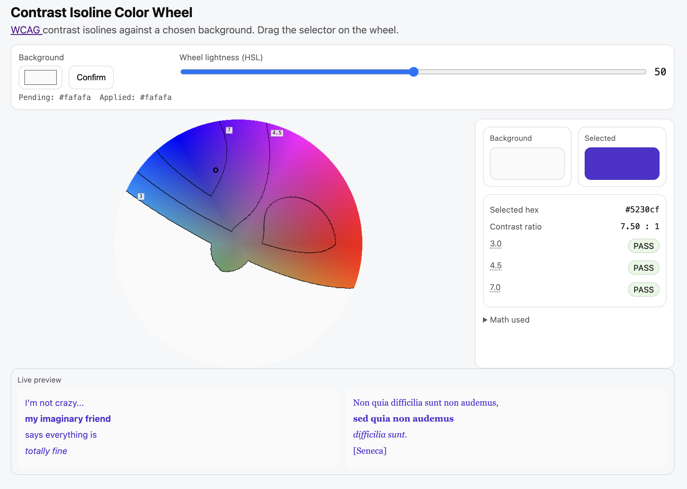

# WCAG Contrast Wheel

A dependency-free interactive color wheel that visualizes WCAG contrast boundaries in real time.

This tool shows which colors meet accessibility contrast requirements against a selected background and visualizes WCAG contrast isolines directly on the color wheel.

## What this tool does

- Displays a full HSL color wheel
- Visualizes contrast ratio boundaries (isolines) for any contrast thresholds
- Computes WCAG contrast mathematically using official standards
- Shows real-time text readability previews
- Allows designers to pick colors that are mathematically accessible

_Note:_ This tool evaluates contrast only — it does not perform subjective “harmony”, branding, or color-blindness heuristics.

### WCAG Standard Used

This project strictly follows the WCAG contrast definition:

- WCAG 2.1 / 2.2
- Color space: sRGB
- RGB primaries: Rec.709
- White point: D65

### Contrast ratio

$$CR=\frac{L_{max}+0.05}{L_{min}+0.05}$$	​

### Relative luminance

$$L=0.2126R+0.7152G+0.0722B$$

(using linearized sRGB)

### Contrast Levels

- 3 : 1 - WCAG AA for large text
- 4.5 : 1 - WCAG AA for normal text
- 7 : 1 - WCAG AAA enhanced contrast

Any color below 3 : 1 is mathematically unusable for readable text.

For more information, visit [this link](https://www.w3.org/TR/WCAG20-TECHS/G17.html).

## What this tool does NOT do

It does not measure color harmony. It does not guarantee branding suitability. It does not evaluate color-blind accessibility. It does not perform aesthetic judgement. 

This is a strict mathematical accessibility instrument.

## Hosting

This tool is fully static and requires no build process.

## License

MIT — free for personal and commercial use.

## Disclaimer

This tool implements WCAG mathematical contrast only. Final accessibility compliance also depends on typography, layout, and UI context.